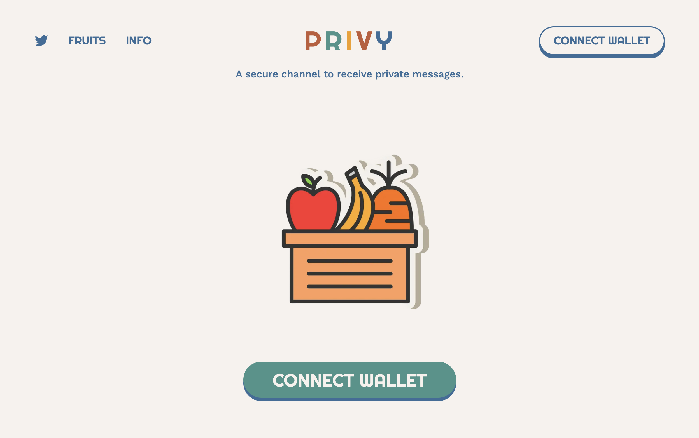

<div align="center">
  <h1>Privy Monorepo</h1>
  <a href="#overview">Overview</a>
  <span>&nbsp;&nbsp;•&nbsp;&nbsp;</span>
  <a href="#tech-stack">Tech Stack</a>
  <span>&nbsp;&nbsp;•&nbsp;&nbsp;</span>
  <a href="#overview">Technical Overview</a>
  <span>&nbsp;&nbsp;•&nbsp;&nbsp;</span>
  <a href="#repo-structure">Repo Structure</a>
  <span>&nbsp;&nbsp;•&nbsp;&nbsp;</span>
  <a href="#development">Development</a>
  <span>&nbsp;&nbsp;•&nbsp;&nbsp;</span>
  <a href="#future-scope">Future Scope</a>
  <br />
  <hr />
</div>

## Overview

Privy is a Solana Devnet SOL application for receiving spam-free private messages through a sharable user link. The receiver pays the transaction fees using a relayer backend service while ensuring client-side message encryption. The project implements token management, categorization, passkey mechanisms, link disabling, and single-message reception.

- [Solana program for Privy](./program/README.md)
- [Backend code for Privy](./grpc-server/README.md)
- [TypeScript SDK for Privy](./sdk/README.md)
- [Frontend code for Privy](./frontend/README.md)

### User Flow

- **User 1 - Message Receiver**
  - Sign up using Solana wallet and create a username and password
  - Buy tokens (currently Devnet SOL)
  - Optionally configure account and categories
  - Share the link and start receiving messages

- **User 2 - Message Sender**
  - Access the shared link and type a message
  - Optionally type a passkey (to reduce spam)
  - Click send

### Features

- Spam-free private messaging via a sharable user link
- Receiver pays transaction fees through a relayer backend service
- Client-side message encryption
- Token management, categorization, passkey mechanisms
- Link disabling and single-message receiving features

### Potential Target Users

- Founders/Managers: Individuals who want to receive critical private feedback.
- Farcaster/Web3 Socials Users: Users who want to receive private messages from their followers.

## Tech Stack

- **Smart Contract (Program)**: Rust, Solana, Anchor Lang, Chai Tests
- **Backend**: Rust, gRPC, Tonic, Postgres, Diesel, Anchor Client
- **Frontend**: React, TypeScript, Ant Design, FingerprintJS, @solana/web3.js
- **TypeScript SDK**:
  - Encryption utilities (used by Program tests & Frontend)
  - Program interaction functions (used by Program tests & Frontend)
  - Server API call functions (used by Server tests & Frontend)

## Technical Overview

### Technical User Flow

- **User 1 (Message Receiver)**
  1. Sign Up: Sign up using Solana wallet and create a username and password.
  2. Token Purchase: Select the token amount and click buy.
  3. Space Allocation: Calculate the amount of space required for storing messages and send allocate_space transactions with create_user transactions.
  4. Account Configuration: Configure account and categories settings, which will require users to pay for the transaction fees.

- **User 2 (Message Sender)**

  1. Access the link
  2. Frontend client makes first call to backend
     - Backend retrieves the user address mapped to the username.
     - Queries user PDA account from the blockchain using the address and the user fingerprint row from the DB.
     - Checks whether the user is allowed to send a message and returns the appropriate response to the client.
  3. If the user is allowed to send a message, the client encrypts the message using the user's public address received from the previous API call and sends the data to the server.
  4. The server again retrieves the PDA account, performs sanity checks, and makes a blockchain transaction to insert the data.

### Relayer / Backend Server Use Cases

- **Transaction Fees**: The relayer server pays transaction fees on behalf of User 1 (message receiver).
- **Username to Address Mapping**: Stores the mapping in off-chain storage due to Solana's account size limitations.
- **Spam Reduction**: Stores end-user browser fingerprints in an off-chain database based on user or user-category settings.
- **On-Chain Data Checks**: Performs checks before inserting data on-chain as we are storing off-chain encrypted data.

### Encryption & Compression

- **Symmetric Encryption**: Utilizes symmetric encryption for categories and username fields in the user PDA account data. Encryption algorithm implemented in both Rust (backend) and TypeScript (frontend/sdk).
- **Asymmetric Encryption**: Implemented a password-based RSA asymmetric encryption algorithm for encrypting sensitive data, which in our case is the private messages users receive. This ensures messages are private from middlemen (including the program owner), making the system truly trustless.
- **Data Compression**: Currently implemented the Brotli compression algorithm for data compression before storing. (The plan is to move to zk-compression in the future.)

### Program Overview

**Accounts**

- **`PrivyUser`**: Represents a user's account storing their username, token limit, categories, messages, and a bump seed for PDA (Program Derived Address).

- **`PrivyConfig`**: Stores the program's configuration data, including the owner's public key and the conversion rate of tokens per SOL.

**Instructions**

1. **`initialize_privy_config`**: Initializes the Privy program's configuration with the specified tokens per SOL rate.

2. **`update_privy_config`**: Updates the existing Privy program configuration with a new tokens per SOL rate.

3. **`withdraw_balance`**: Allows the program owner to withdraw a specified amount of SOL from the program's account.

4. **`create_user`**: Creates a new Privy user account with a username, categories, and an initial deposit of SOL.

5. **`update_username`**: Updates the username of an existing Privy user account.

6. **`add_tokens`**: Adds additional SOL to a Privy user account, increasing their token limit.

7. **`allocate_space`**: Allocates additional space in the Privy user account for storing data such as messages.

8. **`insert_message`**: Inserts an encrypted message into the messages vector of a Privy user account.

9. **`update_category`**: Updates the categories associated with a Privy user account, typically used for message filtering and categorization.


### Database Schemaa

**Table: `fingerprints`**

| Column           | Type     | Description                   |
|------------------|----------|-------------------------------|
| `id`             | Varchar  | Primary key, unique identifier for the fingerprint |
| `user_categories`| Varchar  | Stores user-specific category data |

**Table: `users`**

| Column            | Type        | Description                           |
|-------------------|-------------|---------------------------------------|
| `user_addr`       | Varchar     | Primary key, unique user address      |
| `user_name`       | Varchar     | Username associated with the user     |
| `password_salt`   | Varchar     | Salt used for password hashing        |
| `password_pubkey` | Varchar     | Public key used for password encryption |

## Repo Structure

This repo contains the Solana program source code and client-side program tests written in TypeScript.

```.
├── .vscode             # Program keypairs
├── frontend            # Solana program source code
├── grpc-server         # Backend server helper bash scripts
├── program             # TypeScript source folder
├── sdk                 # TypeScript source folder
└── README.md
```

## Development

1. Follow the [program]() guide and deploy the program.
2. Follow the [grpc-server]() guide, run the db migrations, and start the server.
3. For running the [frontend](), install the dependencies along with the [sdk]() and start the server.

## Future Scope

1. Optimize on-chain program for better transaction fees and conduct an audit
2. Improve data storage decisions for mainnet beta
3. Add support for SPL tokens with Pyth Oracle
4. Explore zk-compression when available for potential mainnet deployment
5. Adopt wallet standard options for data encryption and decryption if introduced